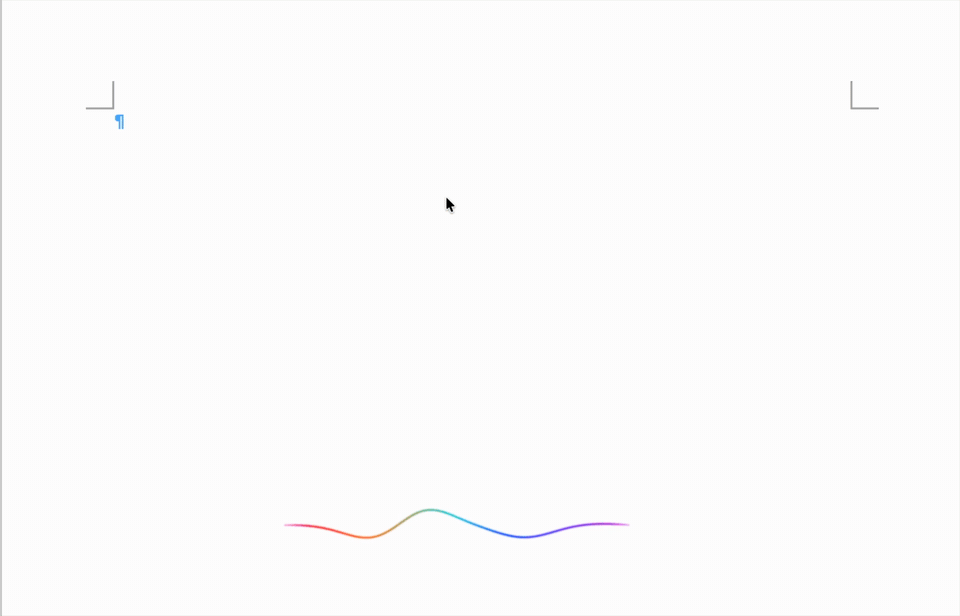

# WaveType

**Typeless-style AI voice input for macOS — 100% local, 100% private.**
基于本地 MLX 模型的 Typeless 平替：语音转写、AI 清洗润色、波形 HUD、个人记忆，全部离线运行。

> Press `Fn`, speak, press `Fn` again — polished text types itself into any app.
> No cloud. No subscription. Your voice never leaves your Mac.



## ✨ Features

- **Push-to-talk dictation** — tap `Fn` to start, tap again to finish; text is typed character-by-character via `CGEvent` Unicode injection (no clipboard, no IME interference, works in any app)
- **Fully local pipeline** — ASR by [Qwen3-ASR](https://huggingface.co/mlx-community/Qwen3-ASR-1.7B-8bit) (MLX, Apple Silicon native) + cleanup by a small Ollama LLM (thinking disabled, latency-first)
- **Waveform HUD** — a Siri-inspired floating energy line: appears from its center while listening, collapses back into the center when done; `Listening` / `Thinking` states with distinct motion & color treatment
- **Speech-gated visualization** — Silero VAD (onnxruntime, CPU) ensures only your voice drives the waveform; keyboard clicks, fans and door slams leave it perfectly flat. Visual gating only — ASR always receives the untouched raw audio
- **Personal memory** — it learns from your corrections **automatically**: after typing, WaveType watches the target field (Accessibility API, ~60s window); if you edit what it wrote, the correction pair is diffed out and stored in a local SQLite dictionary, then immediately re-injected as ASR hotwords + LLM constraints. No gestures needed. (For apps where AX readback fails, select the corrected text and tap `Ctrl+Fn` instead.) The more you use it, the fewer mistakes it makes
- **Plain-text lists** — spoken enumerations become `1. 2. 3.` numbered lists with Tab indentation. No Markdown symbols leaking into your input fields
- **Anti-hallucination guardrails** — fidelity-first prompt + repetition-loop detection + length-ratio fallback to raw ASR output

## 🎬 Demo

Tune the waveform animation without speaking:

```bash
python3 main.py --demo               # simulated mic levels
python3 main.py --demo --demo-secs 10
```

## 🚀 Install

Requirements: macOS on Apple Silicon, Python 3.11+, [Ollama](https://ollama.com) running locally.

```bash
git clone https://github.com/midearobin-beep/WaveType.git
cd WaveType
python3 -m venv .venv && source .venv/bin/activate
pip install -r requirements.txt
ollama pull qwen3.5:4b
cp config.example.yaml config.yaml   # adjust model paths if needed
```

### One-time macOS setup

1. **System Settings → Keyboard → "Press Fn key to" → "Do Nothing"**
   (otherwise macOS hijacks Fn for dictation/emoji)
2. Run from a terminal and grant it: **Microphone**, **Input Monitoring**, **Accessibility**

## 🎙️ Usage

```bash
source .venv/bin/activate
python3 main.py          # start
python3 main.py --raw    # skip LLM cleanup, raw ASR output
python3 main.py -v       # debug logs
```

| Gesture | Action |
|---|---|
| Tap `Fn` | Start listening (waveform appears) |
| Tap `Fn` again | Stop → Thinking → polished text typed at cursor |
| Select corrected text + `Ctrl+Fn` | Learn the correction pair into memory |
| `Ctrl+C` | Quit |

Dictionary management:

```bash
python3 main.py dict                    # list
python3 main.py dict add wrong right    # add manually
python3 main.py dict del wrong right    # remove
```

## 🧠 How the memory flywheel works

```
you fix a mistake → select it → Ctrl+Fn
  → diff against last output (learn.py)
  → correction pair → SQLite dictionary
  → ① ASR context hotwords (prevent at source)
    ② LLM prompt constraints (correct as fallback)
  → instant effect, no restart
```

All data stays in `data/memory.db` on your machine.

## 🏗️ Architecture

```
Fn (Quartz event tap) → 16kHz mic (sounddevice)
  → Qwen3-ASR (MLX)            ← hotwords from memory
  → Ollama LLM cleanup         ← dictionary constraints
  → CGEvent Unicode injection  → any app

HUD: NSPanel (borderless/transparent/non-activating)
     CAShapeLayer + CAGradientLayer, 60fps
     voice level → amplitude / glow / harmonic complexity
```

Threading note: MLX GPU streams are bound to the creating thread — the ASR
session is lazily created inside the worker thread; the main thread runs the
NSApp event loop for the HUD.

## ⚙️ Tuning

All visual constants (HUD size, amplitude, glow, gradient speed, attack/release,
animation durations) live in the `C` class at the top of `voice_input/hud.py`.
Run `--demo` and tweak live.

## 🗺️ Roadmap

- [x] Personal dictionary with correction capture
- [ ] Per-app style profiles (few-shot tone adaptation)
- [ ] Ask / Translate mode (selection → voice command → inline result)
- [ ] LaunchAgent / menu-bar app packaging

## 📄 License

MIT
